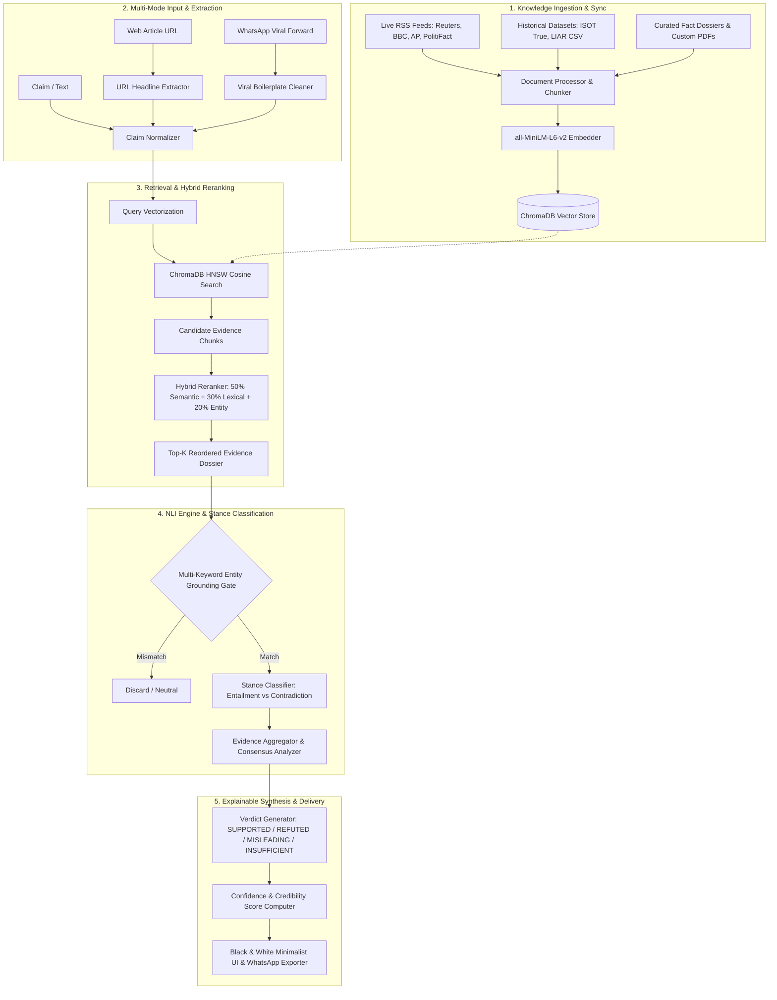

<div align="center">

# 🛡️ TruthLens
### An Explainable Retrieval-Augmented Generation (RAG) System for Automated Fact Verification

[](https://www.python.org/)
[](https://fastapi.tiangolo.com/)
[](https://www.trychroma.com/)
[](LICENSE)
[](https://vercel.com/)

**See the Truth Behind Every Claim — Evidence-Grounded, Explainable, and Real-Time.**

[Live Architecture](#-system-architecture) • [Why TruthLens is Unique](#-why-truthlens-is-unique) • [Daily News Engine](#-automated-daily-news-ingestion--crawler) • [API Reference](#-api-specification) • [Quickstart](#-installation--quickstart)

</div>

---

## 📌 Executive Summary

**TruthLens** is a specialized, production-grade fact-verification platform built on an explainable Retrieval-Augmented Generation (RAG) architecture. Unlike generic conversational chatbots that are prone to hallucinations, TruthLens acts as an impartial, evidence-bound verification engine.

The system ingests real-time global news feeds, historical ground-truth archives (ISOT Reuters & PolitiFact LIAR), and curated reference dossiers. When presented with a claim, news URL, or viral WhatsApp forward, TruthLens searches its vector database, reranks retrieved evidence using a hybrid semantic-lexical algorithm, enforces strict multi-keyword entity grounding, and synthesizes a verifiable verdict with complete source attribution.

```text
                                  ┌─────────────────────────────┐
                                  │   4 EXPLAINABLE VERDICTS    │
                                  ├─────────────────────────────┤
                                  │  ✅ SUPPORTED               │
                                  │  ❌ REFUTED                 │
                                  │  ⚠️ MISLEADING              │
                                  │  ❓ INSUFFICIENT EVIDENCE   │
                                  └─────────────────────────────┘
```

---

## 💎 Why TruthLens is Unique

Traditional search engines and LLM chatbots are fundamentally not built for verifiable truth verification. Here is how TruthLens differs:

| Feature / Capability | Generic LLMs (ChatGPT / Claude) | Standard Search Engines (Google / Bing) | Conventional Fact-Check Sites (Snopes / PolitiFact) | **TruthLens RAG Engine** |
| :--- | :--- | :--- | :--- | :--- |
| **Hallucination Resistance** | ❌ Prone to plausible fabrication | ❌ Index contains SEO spam & unverified blogs | ✅ High human accuracy | **🛡️ 100% Bound to Authoritative Knowledge Vault** |
| **Explainable Evidence Breakdown** | ❌ Opaque narrative generation | ❌ Gives links, no sentence-level stance | ⚠️ Manual long-form articles | **✅ Fine-grained Supporting vs Contradicting chunk audit** |
| **Real-Time 24h News Sync** | ❌ Static training cutoffs | ⚠️ Search index ranking favors traffic | ⚠️ Manual editorial cycle | **⚡ Automated 24h RSS Vector Ingestion (Reuters, AP, BBC, PolitiFact)** |
| **WhatsApp / Viral Forward Cleaner** | ❌ Confused by forward boilerplate | ❌ Fails on raw copy-pasted chatter | ❌ No direct tool | **💬 Automated Regex Stripper for clickbait & forward headers** |
| **URL Article Claim Extractor** | ⚠️ Requires manual copy-pasting | ❌ Inundated with page ads/noise | ❌ Manual submission | **🔗 1-Click Web Scraping & Instant Claim Verification** |
| **1-Click Shareable WhatsApp Report** | ❌ No structured export format | ❌ Sharing links only | ❌ Manual screenshotting | **📋 Instant Copyable Social Media / Group Chat Debunk Report** |
| **Offline Zero-Dependency NLI** | ❌ Requires costly cloud API calls | ❌ Requires cloud network | ❌ Web-only | **🧠 Built-in deterministic NLI heuristics engine** |

---

## 🏛️ System Architecture

TruthLens employs a modular pipeline composed of 5 distinct stages:



---

## 🧮 Algorithmic Formulations

### 1. Hybrid Semantic-Lexical Reranker
Every retrieved candidate chunk $c_i$ for query $q$ is rescored using a weighted tripartite formulation:

$$\text{FinalScore}(q, c_i) = w_1 \cdot S_{\text{semantic}}(q, c_i) + w_2 \cdot S_{\text{lexical}}(q, c_i) + w_3 \cdot S_{\text{entity}}(q, c_i)$$

Where:
- **Semantic Score** $S_{\text{semantic}}$: Cosine similarity of embedding vectors $\frac{\vec{u} \cdot \vec{v}}{\|\vec{u}\| \|\vec{v}\|}$.
- **Lexical Score** $S_{\text{lexical}}$: Normalized token-overlap intersection $\frac{|T_q \cap T_{c_i}|}{|T_q|}$.
- **Entity Overlap** $S_{\text{entity}}$: Named-entity and numerical token overlap ratio.
- **Default Weights**: $w_1 = 0.50, w_2 = 0.30, w_3 = 0.20$.

### 2. Multi-Keyword Entity Grounding Gate
To prevent hallucinated stances or false refutations on unrelated documents that share a single common token, TruthLens enforces an entity gating threshold:

$$\text{EntityOverlap}(q, c_i) \ge \min(2, |E_q|)$$

Where $E_q$ is the set of core named entities in the claim. If the chunk does not satisfy this threshold, its stance is constrained to `NEUTRAL`.

### 3. Confidence & Agreement Computation
- **Supporting Confidence**: $C_{\text{sup}} = \max(\text{score}(c)) \cdot 100$
- **Contradicting Confidence**: $C_{\text{con}} = \max(\text{score}(c)) \cdot 100$
- **Mixed Evidence Detection**: If $N_{\text{sup}} > 0$ and $N_{\text{con}} > 0$, verdict automatically yields **`MISLEADING`** with a blended confidence score:

$$\text{Confidence}_{\text{misleading}} = \frac{C_{\text{sup}} + C_{\text{con}}}{2}$$

---

## 📰 Automated Daily News Ingestion & Crawler

TruthLens includes a continuous 24-hour background scheduler (`NewsSyncService`) that keeps the evidence vault updated:

- **Monitored Authoritative Feeds**:
  - `Reuters World News` (Credibility: 98.0%)
  - `Associated Press News` (Credibility: 97.0%)
  - `BBC News Top Stories` (Credibility: 96.0%)
  - `PolitiFact Fact-Checks` (Credibility: 99.0%)
  - `Google News International` (Credibility: 90.0%)
- **Automatic Deduplication**: Hashes and URL records in SQLite database ensure zero duplicate embeddings.
- **Historical Ground-Truth Datasets**: Pre-indexes verified articles from ISOT Reuters and PolitiFact LIAR.

---

## 📁 Repository Structure

```text
TruthLens/
├── backend/
│   ├── __init__.py
│   ├── config.py                     # System configurations & hyperparameters
│   ├── main.py                       # FastAPI application & startup scheduler
│   ├── api/
│   │   ├── __init__.py
│   │   └── routes.py                 # REST API endpoints
│   ├── database/
│   │   ├── __init__.py
│   │   ├── db.py                     # SQLite thread-safe operations & schema
│   │   └── truthlens.db              # SQLite persistent database
│   ├── models/
│   │   ├── __init__.py
│   │   └── schemas.py                # Pydantic request/response schemas
│   └── services/
│       ├── __init__.py
│       ├── document_processor.py      # Recursive text chunker & PDF extractor
│       ├── embedding_service.py       # SentenceTransformers / Fallback Embedder
│       ├── retrieval_service.py       # ChromaDB HNSW vector index
│       ├── reranking_service.py       # Hybrid semantic-lexical reranker
│       ├── llm_service.py             # Multi-provider LLM & Offline NLI Engine
│       ├── news_sync_service.py       # Daily live RSS sync & URL extractor
│       └── verification_service.py    # End-to-end verification coordinator
├── frontend/
│   └── index.html                    # Single-Page Application (React 18 + Tailwind)
├── data/
│   ├── raw/                          # ISOT & LIAR dataset directories
│   └── trusted_docs/                 # Curated reference fact dossiers
│       ├── world_leaders_and_governance.txt
│       ├── economy_gdp_rankings_2025.txt
│       ├── climate_renewable_energy_2024_2025.txt
│       ├── medical_and_public_health_facts.txt
│       └── artificial_intelligence_benchmarks.txt
├── chroma_db/                        # ChromaDB persistent vector storage
├── api/
│   └── index.py                      # Vercel serverless entrypoint
├── vercel.json                       # Vercel deployment routing configuration
├── requirements.txt                  # Python dependencies
└── README.md                         # Complete project documentation
```

---

## 🔌 API Specification

### 1. Fact Verification
```http
POST /api/verify
Content-Type: application/json

{
  "claim": "Renewable energy accounts for over 30 percent of global electricity.",
  "llm_provider": "auto"
}
```
**Response (200 OK):**
```json
{
  "claim": "Renewable energy accounts for over 30 percent of global electricity.",
  "verdict": "SUPPORTED",
  "confidence_score": 86.0,
  "source_credibility_score": 96.0,
  "evidence_agreement_score": 100.0,
  "explanation": "Corroborated by authoritative documentation in the knowledge vault...",
  "supporting_evidence": [...],
  "contradicting_evidence": [],
  "retrieved_sources": [...]
}
```

### 2. Daily Trending News & Viral Rumors
```http
GET /api/news/trending
```
Returns today's active news stories with categories and source references ready for 1-click verification.

### 3. Extract Claim from News URL
```http
POST /api/news/extract-url
Content-Type: application/json

{ "url": "https://www.reuters.com/world/india/..." }
```

### 4. Clean Viral WhatsApp Forward
```http
POST /api/news/clean-forward
Content-Type: application/json

{ "text": "Forwarded as received: URGENT ALERT! Antibiotics cure flu. Share to 10 groups!" }
```
**Response:**
```json
{
  "cleaned_claim": "Antibiotics cure flu.",
  "original_length": 81,
  "cleaned_length": 21
}
```

### 5. Trigger Daily Live News Sync
```http
POST /api/news/sync?max_per_feed=10
```

### 6. Train on Existing Datasets (ISOT True & LIAR)
```http
POST /api/news/train-dataset?max_articles=100
```

---

## ⚡ Installation & Quickstart

### Prerequisites
- Python 3.11, 3.12, or 3.13
- Git

### 1. Clone Repository
```bash
git clone https://github.com/Prashantj44/Truth-Lens.git
cd Truth-Lens
```

### 2. Install Dependencies
```bash
pip install -r requirements.txt
```

### 3. Launch TruthLens Engine
```bash
python -m uvicorn backend.main:app --host 127.0.0.1 --port 8000 --reload
```

### 4. Open in Browser
Open **`http://127.0.0.1:8000`** in your browser to access the complete application.

---

## 🌐 Deploying to Vercel

TruthLens is pre-configured for one-click deployment on **Vercel**:

1. Push your repository to GitHub:
   ```bash
   git push origin main
   ```
2. In the [Vercel Dashboard](https://vercel.com/new), select your `Truth-Lens` repository.
3. Vercel detects `vercel.json` and `api/index.py` automatically.
4. Click **Deploy**.

---

## 👥 Contributors & Institutional Affiliation

- **Project Lead**: Prashant Jha
- **Institution**: St. Francis Institute of Technology (SFIT)
- **Department**: Department of Artificial Intelligence & Data Science

---

## 📄 License
This project is licensed under the MIT License — see the [LICENSE](LICENSE) file for details.
