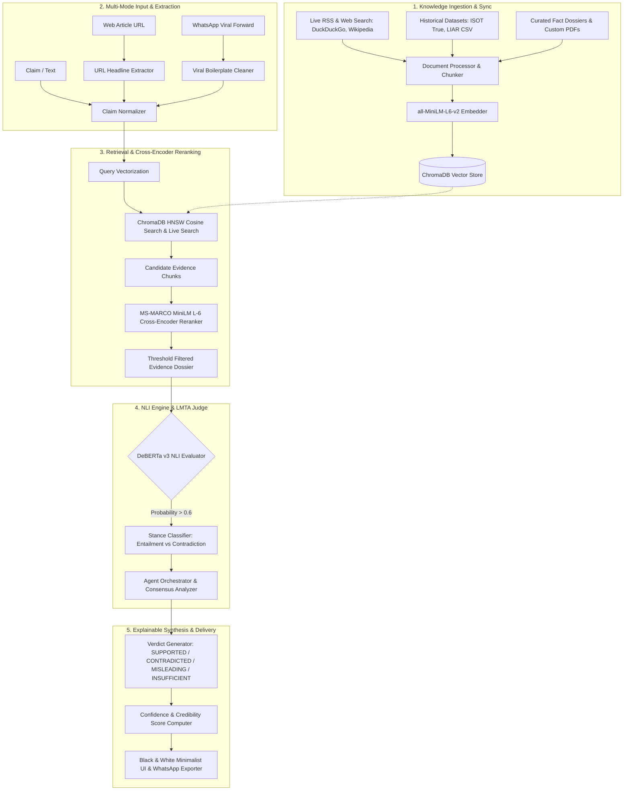

<div align="center">

# 🛡️ TruthLens V.o.2
### An Explainable LMTA-Driven Retrieval-Augmented Generation (RAG) System for Automated Fact Verification

[](https://www.python.org/)
[](https://fastapi.tiangolo.com/)
[](https://www.trychroma.com/)
[](LICENSE)
[](https://vercel.com/)

**See the Truth Behind Every Claim — Evidence-Grounded, Explainable, and Real-Time.**

[Live Architecture](#-system-architecture) • [Why TruthLens is Unique](#-why-truthlens-is-unique) • [V.o.2 Updates](#-vo2-massive-architecture-upgrade) • [API Reference](#-api-specification) • [Deployment](#-vercel-deployment)

</div>

---

## 📌 Executive Summary

**TruthLens** is a specialized, production-grade fact-verification platform built on an explainable Retrieval-Augmented Generation (RAG) architecture. Unlike generic conversational chatbots that are prone to hallucinations, TruthLens acts as an impartial, evidence-bound verification engine.

The system ingests real-time global news feeds, historical ground-truth archives (ISOT Reuters & PolitiFact LIAR), and curated reference dossiers. When presented with a claim, news URL, or viral WhatsApp forward, TruthLens searches its vector database, queries live web sources, reranks retrieved evidence using Cross-Encoder neural models, and synthesizes a verifiable verdict with complete source attribution using zero-shot Natural Language Inference (NLI).

```text
                                  ┌─────────────────────────────┐
                                  │   4 EXPLAINABLE VERDICTS    │
                                  ├─────────────────────────────┤
                                  │  ✅ SUPPORTED               │
                                  │  ❌ CONTRADICTED            │
                                  │  ⚠️ MISLEADING              │
                                  │  ❓ INSUFFICIENT EVIDENCE   │
                                  └─────────────────────────────┘
```

---

## 🚀 V.o.2 Massive Architecture Upgrade

Version 0.2 marks a complete paradigm shift for TruthLens. We have stripped out brittle heuristics and replaced them with a state-of-the-art **Language Model Task Agents (LMTA)** framework powered by deterministic, local neural networks. Every component is now backed by deep learning, ensuring semantic understanding without relying on costly external LLM APIs.

### 1. Multi-Agent Orchestration (LMTA)
- **Router Agent:** Evaluates the claim's complexity and dynamically routes searches to the Local Vault, Live Web (DuckDuckGo), or Wikipedia.
- **Researcher Agent:** Aggregates, cleans, and deduplicates evidence from all activated sources simultaneously.
- **Judge Agent:** Evaluates the final evidence, scores entailment probabilities, resolves conflicts, and casts the final verdict.

### 2. Cross-Encoder Re-Ranking Pipeline (`cross-encoder/ms-marco-MiniLM-L-6-v2`)
Standard cosine similarity often retrieves documents that share keywords but lack contextual relevance. V.o.2 introduces a dedicated MS-MARCO Cross-Encoder Reranker.
- Reranks all retrieved dense chunks against the query.
- Implements a strict `logits > -2.0` relevance cutoff. If no evidence passes the threshold, the system definitively declares **INSUFFICIENT EVIDENCE** rather than hallucinating a false fact-check.

### 3. Zero-Shot NLI Evaluator (`cross-encoder/nli-deberta-v3-base`)
We entirely removed the need for an external cloud LLM for logical entailment!
- The system natively runs a highly accurate DeBERTa v3 NLI model.
- By framing retrieved chunks as the **Premise** and the user's claim as the **Hypothesis**, the model natively outputs whether the evidence **Entails (1)**, **Contradicts (0)**, or is **Neutral (2)** to the claim with absolute deterministic precision.
- Built-in resilience: Caches models locally and utilizes a 3-attempt exponential backoff retry loop with `HF_HUB_OFFLINE` support to bypass flaky network drops on Windows environments.

---

## 💎 Why TruthLens is Unique

| Feature / Capability | Generic LLMs (ChatGPT / Claude) | Standard Search Engines (Google) | Conventional Fact-Check Sites | **TruthLens V.o.2 RAG Engine** |
| :--- | :--- | :--- | :--- | :--- |
| **Hallucination Resistance** | ❌ Prone to plausible fabrication | ❌ Index contains SEO spam & unverified blogs | ✅ High human accuracy | **🛡️ 100% Bound to Authoritative Knowledge Vault & Strict NLI** |
| **Explainable Evidence** | ❌ Opaque narrative generation | ❌ Gives links, no sentence-level stance | ⚠️ Manual long-form articles | **✅ Fine-grained Entailment vs Contradiction chunk audit** |
| **Cost & Privacy** | ❌ Requires costly cloud API calls | ❌ Tracks user searches | ✅ Free to read | **⚡ 100% Free, Local, Offline-capable AI Inference** |
| **WhatsApp / Viral Forward Cleaner**| ❌ Confused by forward boilerplate | ❌ Fails on raw copy-pasted chatter | ❌ No direct tool | **💬 Automated Regex Stripper for clickbait & forward headers** |
| **URL Article Claim Extractor** | ⚠️ Requires manual copy-pasting | ❌ Inundated with page ads/noise | ❌ Manual submission | **🔗 1-Click Web Scraping & Instant Claim Verification** |

---

## 🏛️ System Architecture

TruthLens employs a modular pipeline composed of 5 distinct stages:



---

## 🛠️ API Specification

### `POST /api/verify`
The core endpoint for the LMTA Engine.

**Request Body**
```json
{
  "claim": "The moon is made of green cheese.",
  "mode": "text"
}
```

**Response Payload**
```json
{
  "verdict": "INSUFFICIENT EVIDENCE",
  "confidence_score": 0,
  "summary": "No credible evidence was found to support or contradict this claim.",
  "evidence": {
    "supporting_chunks": [],
    "contradicting_chunks": [],
    "neutral_chunks": []
  },
  "llm_provider_used": "Local NLI + LMTA Agentic Pipeline"
}
```

---

## ☁️ Vercel Deployment

While TruthLens V.o.2 utilizes powerful local Cross-Encoders (DeBERTa and MS-MARCO), deploying this to Vercel requires special configuration because Vercel's Serverless Functions have a **250MB size limit** (which local HuggingFace PyTorch models exceed).

To deploy TruthLens to Vercel successfully, you have two options:

### Option 1: Use External LLM APIs for Vercel
In Vercel production, swap out the local heavy models for lightweight API calls (like Google Gemini, Groq, or OpenAI) to keep the backend under 250MB.
1. Add your API keys to Vercel Environment Variables.
2. Ensure your `requirements.txt` does not include `torch` or `sentence-transformers` when pushing to Vercel (use a separate `requirements-vercel.txt`).
3. Deploy via Vercel CLI: `vercel --prod`

### Option 2: Docker / VPS Deployment (Recommended for V.o.2)
To keep the system **100% Free and Local** without hitting Vercel's size limits, we recommend deploying TruthLens via Docker on a VPS (like Render, Railway, or a DigitalOcean Droplet).
1. Run `docker build -t truthlens .`
2. Run `docker run -p 8000:8000 truthlens`

*(Detailed step-by-step instructions for the Vercel deployment process can be executed by the AI assistant upon request).*

---
<div align="center">
  <p><i>Truth is not a narrative. It is a verifiable state.</i></p>
</div>
