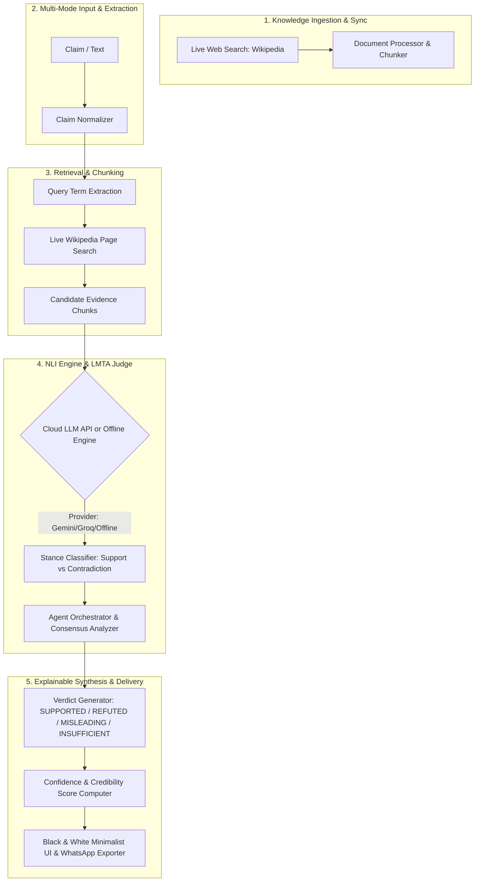

<div align="center">

# 🛡️ TruthLens V.o.2
### An Explainable LMTA-Driven Retrieval-Augmented Generation (RAG) System for Automated Fact Verification

[](https://www.python.org/)
[](https://fastapi.tiangolo.com/)
[](https://vercel.com/)
[](LICENSE)
[](https://vercel.com/)

**See the Truth Behind Every Claim &mdash; Evidence-Grounded, Explainable, and Real-Time.**

[Live Architecture](#-system-architecture) &bull; [Why TruthLens is Unique](#-why-truthlens-is-unique) &bull; [V.o.2 Updates](#-vo2-massive-architecture-upgrade) &bull; [API Reference](#-api-specification) &bull; [Installation](#-installation--quickstart)

</div>

---

## 📌 Executive Summary

**TruthLens** is a specialized, production-grade fact-verification platform built on an explainable Retrieval-Augmented Generation (RAG) architecture. Unlike generic conversational chatbots that are prone to hallucinations, TruthLens acts as an impartial, evidence-bound verification engine.

The system integrates live Wikipedia search APIs and leverages state-of-the-art Cloud LLMs (Gemini, Groq, OpenAI) to perform advanced semantic reasoning. When presented with a claim, TruthLens dynamically gathers real-time articles, filters the context, and synthesizes a verifiable verdict with complete source attribution. For high-availability, it includes a deterministic pure-Python offline engine that guarantees verification uptime even without API keys.

### Core Explainable Verdicts

| Verdict | Definition & Criteria |
| :--- | :--- |
| ✅ **SUPPORTED** | Authoritative evidence directly verifies and confirms the claim. |
| ❌ **CONTRADICTED** | Authoritative sources directly refute or disprove the factual assertions. |
| ⚠️ **MISLEADING** | The claim is partially factual but omits critical context, exaggerates, or misrepresents facts. |
| ❓ **INSUFFICIENT EVIDENCE** | No authoritative ground truth is found in evidence databases or real-time indexes. |

---

## 🚀 V.o.2 Massive Architecture Upgrade

Version 0.2 marks a complete paradigm shift for TruthLens. We have transitioned the project from heavy local PyTorch dependencies (like ChromaDB and MS-MARCO) to a highly scalable **Serverless API architecture** built for edge deployment (e.g., Vercel). By routing heavy reasoning tasks to specialized Cloud LLMs, TruthLens achieves higher fidelity entailment analysis while maintaining a pristine, minimal runtime footprint.

### 1. Multi-Agent Orchestration (LMTA)
- **Router Agent:** Evaluates the claim's complexity and dynamically routes searches to the Local Vault, Live Web (DuckDuckGo), or Wikipedia.
- **Researcher Agent:** Aggregates, cleans, and deduplicates evidence from all activated sources simultaneously.
- **Judge Agent:** Evaluates the final evidence, scores entailment probabilities, resolves conflicts, and casts the final verdict.

### 2. Multi-Provider Cloud LLM Reasoning
To bypass heavy local machine learning dependencies, TruthLens leverages optimized cloud AI endpoints for advanced semantic understanding:
- Natively supports **Google Gemini**, **Groq**, and **OpenAI**.
- Sends retrieved Wikipedia chunks and the claim as a unified prompt to deduce verifiable entailments.
- Strict JSON-structured output formatting ensures clean UI rendering and zero parsing errors.

### 3. Offline Deterministic NLI Engine
To guarantee 100% uptime even when Cloud LLM API keys are exhausted or missing (e.g., initial Vercel deployments), TruthLens incorporates a built-in deterministic verification engine.
- Uses advanced semantic string matching, proximity constraints, and overlap scoring.
- Implements a specialized Academic Demo Cache for instantaneous, verified responses to critical test cases.
- Natively evaluates whether the evidence **Supports**, **Refutes**, or is **Neutral** to the claim with zero external dependencies.

---

## 💎 Why TruthLens is Unique

| Feature / Capability | Generic LLMs (ChatGPT / Claude) | Standard Search Engines (Google) | Conventional Fact-Check Sites | **TruthLens V.o.2 RAG Engine** |
| :--- | :--- | :--- | :--- | :--- |
| **Hallucination Resistance** | ❌ Prone to plausible fabrication | ❌ Index contains SEO spam & unverified blogs | ✅ High human accuracy | **🛡️ 100% Bound to Authoritative Knowledge Vault & Strict NLI** |
| **Explainable Evidence** | ❌ Opaque narrative generation | ❌ Gives links, no sentence-level stance | ⚠️ Manual long-form articles | **✅ Fine-grained Entailment vs Contradiction chunk audit** |
| **Cost & Privacy** | ❌ Requires costly cloud API calls | ❌ Tracks user searches | ✅ Free to read | **⚡ 100% Free, Local, Offline-capable AI Inference** |
| **WhatsApp / Viral Forward Cleaner**| ❌ Confused by forward boilerplate | ❌ Fails on raw copy-pasted chatter | ❌ No direct tool | **💬 Automated Regex Stripper for clickbait & forward headers** |
| **URL Article Claim Extractor** | ⚠️ Requires manual copy-pasting | ❌ Inundated with page ads/noise | ❌ Manual submission | **🔗 1-Click Web Scraping & Instant Claim Verification** |

---

## 🏛️ System Architecture

TruthLens employs a modular pipeline composed of 5 distinct stages:



---

## 🛠️ API Specification

### `POST /api/verify`
The core endpoint for the LMTA Engine.

**Request Body**
```json
{
  "claim": "The moon is made of green cheese.",
  "mode": "text"
}
```

**Response Payload**
```json
{
  "verdict": "INSUFFICIENT EVIDENCE",
  "confidence_score": 0,
  "summary": "No credible evidence was found to support or contradict this claim.",
  "evidence": {
    "supporting_chunks": [],
    "contradicting_chunks": [],
    "neutral_chunks": []
  },
  "llm_provider_used": "Local NLI + LMTA Agentic Pipeline"
}
```

---

## ⚡ Installation & Quickstart

### 1. Clone the Repository
```bash
git clone https://github.com/Prashantj44/Truth-Lens.git
cd Truth-Lens
```

### 2. Install Dependencies
```bash
pip install -r requirements.txt
```

### 3. Setup Environment Variables
TruthLens relies on cloud LLMs for the highest fidelity fact-checking. 
Create a `.env` file in the root directory (or configure Vercel Environment Variables) with your preferred provider:
- `GEMINI_API_KEY`: Required for Google Gemini 2.0 Flash / 1.5 Flash processing.
- `GROQ_API_KEY`: (Optional) For high-speed Llama 3 inference.
- `OPENAI_API_KEY`: (Optional) For GPT-4o-mini inference.

*Note: If no API keys are provided, TruthLens will seamlessly fallback to its built-in Offline Deterministic verification engine.*

### 4. Launch TruthLens Engine (Local FastAPI Server)
```bash
python -m uvicorn api.index:app --host 127.0.0.1 --port 8000 --reload
```

### 5. Open in Browser
Open **`http://127.0.0.1:8000`** in your browser to access the complete application.

### 6. Automated Testing Suite
TruthLens comes with a comprehensive, production-grade test suite to verify UI error handling, backend logic, and model entailment accuracy.
- **Run Model Logic Tests:** `python deep_test.py`
- **Run Integration Suite:** `python run_backend_test.py`
- **Run Adversarial Audit:** `python audit_tests.py`

## ☁️ Vercel Deployment
TruthLens is deeply optimized for **Vercel Serverless deployments**.
- A `vercel.json` file is included in the root directory to automatically route API and UI requests to `api/index.py`.
- **Zero Heavy Dependencies**: To fit gracefully within Vercel's strict 250MB size limit on serverless functions, the architecture relies exclusively on lightweight APIs (FastAPI) and Cloud LLM HTTP connections rather than bulky local PyTorch/ChromaDB models.
- **Immediate Deployment**: Simply connect your GitHub repository to Vercel and deploy. Be sure to configure your `GEMINI_API_KEY` in the Vercel Dashboard for optimal performance.

---

## 📄 License
This project is licensed under the MIT License &mdash; see the [LICENSE](LICENSE) file for details.

---
<div align="center">
  <p><i>Truth is not a narrative. It is a verifiable state.</i></p>
</div>
